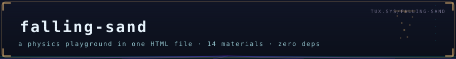
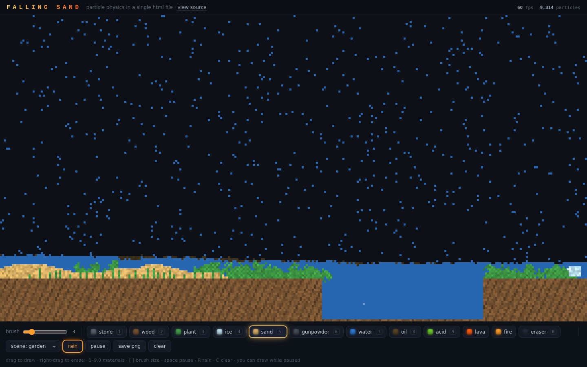
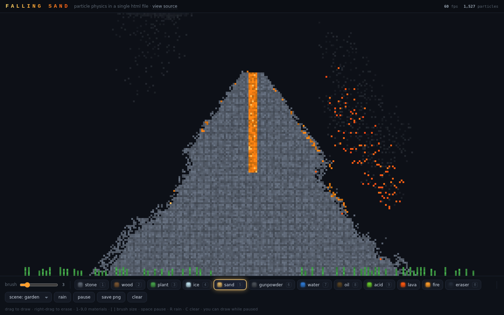

**An entire falling-sand physics playground in one HTML file.**
No build. No dependencies. No framework. Save `index.html`, double-click it, and you're pouring lava.

**Play it live: <https://ssmurfgg04-gif.github.io/falling-sand/>**

## 🌋 What you get

Fourteen materials (thirteen, plus an eraser) that interact through gravity, density, temperature and a bit of luck:

| material | type | behavior |
|---|---|---|
| sand | powder | piles into dunes, sinks in water |
| gunpowder | powder | falls like sand — until it meets fire |
| water | liquid | flows, levels out, puts out fires, feeds plants |
| oil | liquid | floats on water, burns ferociously |
| acid | liquid | dissolves everything except stone |
| lava | liquid | slow and glowing; ignites, boils water, crusts into stone |
| fire | energy | rises, spreads, dies into smoke |
| steam | gas | bubbles up through liquids, condenses back into water |
| smoke | gas | drifts upward and fades |
| plant | static | grows where it touches water, burns fast |
| wood | static | burns slowly, good scaffolding |
| ice | static | melts near heat, slowly freezes adjacent water |
| stone | static | the one thing acid can't eat |
| eraser | tool | removes matter |

## 🧪 Experiments worth trying

- Pour **water** onto **lava** — it flashes to steam and crusts the flow into stone.
- Float **oil** on water, then drop fire on it. Watch the slick burn down to the waterline.
- Plant a garden, water it, and watch it **grow** — then burn it all down.
- Bury **gunpowder** in a sand dune and touch a match to it. Chain reactions included.
- Drip **acid** along a stone channel into a wood dam.

## 🗻 Volcano included

Pick *scene: volcano*, poke the crater with fire, and enjoy the show. There is gunpowder
buried in the mountain. Finding it is your problem.

## 🎛️ Controls

| input | action |
|---|---|
| drag | draw with the selected material |
| right-drag | erase |
| 1–9, 0 | pick material |
| [ and ] | brush size |
| space | pause |
| R | toggle rain |
| C | clear |

Works with touch. Everything runs locally — nothing is loaded, tracked or sent anywhere.
You can even draw while paused, if you like building dioramas before the physics starts.

## ⚙️ How it works

A falling-sand game is a cellular automaton: the world is a grid where every cell holds one
material, and each tick a pass of local rules rewrites the grid.

- The world lives in three flat typed arrays (`cells`, `life`, `noise`) — one byte per cell
  each, no objects, no GC pressure.
- Each tick scans **bottom-up** so gravity resolves in a single pass; a `moved` bitmask
  stops particles from acting twice in one frame.
- Liquids disperse sideways up to N cells per tick, which is what makes them level out
  into flat surfaces.
- Densities let particles swap places: sand sinks through water, water sinks through oil,
  steam bubbles up through everything.
- Fire, steam and smoke carry per-cell lifetimes; gunpowder defers a radius scan that
  converts cells to fire, smoke and empty — and chains into any gunpowder it finds.
- Rendering writes every pixel into an `ImageData` buffer and pushes it with
  `putImageData`; the canvas is then CSS-scaled with `image-rendering: pixelated`
  for the crunchy look.

That's roughly O(width x height) per tick — about 43,000 cells at 60 fps in plain JavaScript,
in one file you can actually read end to end.

## 🧘 Why one file?

Because "download this and double-click it" is the most honest distribution channel
software has. No toolchain between you and the thing, no supply chain to audit, nothing
to install. The entire game — simulation, renderer, UI, scenes — fits in a single readable
file you can open in any editor and change tonight.

If you lose an afternoon to this, a star helps other people lose theirs too.

## 📜 License

[MIT](LICENSE) — do whatever you want, just keep the notice.
Pull requests welcome: new materials (glass? bees?), new scenes, mobile polish.

---

🐧 part of <a href="https://github.com/ssmurfgg04-gif">the ice shelf</a> · cold code, warm commits ❄️

